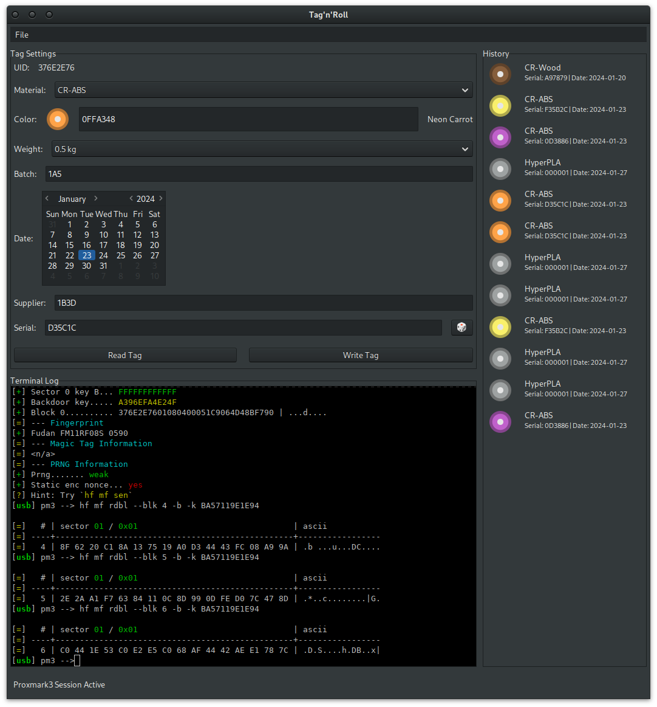

# Tag'n'Roll

A GTK-based GUI application for managing Creality RFID tags for 3D printing filament spools ("rolls") using a [Proxmark3](https://proxmark.com/) device.

> [!NOTE]
> This software was vibe-coded specifically for my use case, my data, 
> and my questionable life choices — your mileage will absolutely vary.
> No warranties are offered beyond "it works for me," which, legally
> speaking, is not a warranty at all.

## Screenshot



## Features

- **Read RFID Tags**: Read tag data from Creality filament spools
- **Write RFID Tags**: Write new filament data to MIFARE Classic 1K tags
- **Color Picker**: Easy color selection with presets and human-readable color names
- **Tag History**: Save and reload tag configurations
- **Proxmark3 Integration**: Direct integration with Proxmark3 client
- **Terminal Output**: Built-in VTE terminal to monitor Proxmark3 session output

## Requirements

- Go 1.21 or higher
- GTK3 development libraries
- libvte development lbraries
- Proxmark3 client (pm3 or proxmark3 command) with matching firmware
- Linux system (GTK3)

## Installation

### 1. Install Go

Download and install Go from https://go.dev/dl/ or use your package manager:

```bash
# Ubuntu/Debian
sudo apt update
sudo apt install golang

# Fedora
sudo dnf install golang

# Arch Linux
sudo pacman -S go
```

### 2. Install GTK3 Development Libraries

```bash
# Ubuntu/Debian
sudo apt install libgtk-3-dev pkg-config libvte-2.91-dev

# Fedora
sudo dnf install gtk3-devel pkg-config libvte-devel

# Arch Linux
sudo pacman -S gtk3 pkg-config libvte
```

### 3. Install Proxmark3 Client

Install the Proxmark3 Iceman fork and ensure the `pm3` or `proxmark3` command is in your PATH.

See: https://github.com/RfidResearchGroup/proxmark3

### 4. Build the Application

```bash
go mod tidy
go build -o tagnroll
```

## Usage

### Running the Application

```bash
./tagnroll
```

### Configuration

The application looks for a configuration file at `~/.tagnroll`. If it doesn't exist, a default configuration will be created.
Note that encryption keys for reading/writing encrypted tags are not configured by default and need to be configured in the `File->Settings` dialog.

## Troubleshooting

### Proxmark3 Not Detected

- Ensure Proxmark3 is connected via USB
- Check that `pm3` or `proxmark3` command is in your PATH or configured in the application
- Try running `pm3 --help` to verify installation

### Permission Errors

- You may need to add your user to the appropriate groups for USB device access
- Consider using `sudo` for Proxmark3 operations if needed

### Auth error

- Ensure that encryption keys are configured in the `File->Settings` dialog.

## License

This tool is based on the work from:
- https://deusrex2k.github.io/proxmark4cfs.html
- https://github.com/flamebarke/creality_rfid
- https://github.com/wilburx9/color-name

## Acknowledgments

- Original JavaScript implementation by deusrex
- Python implementation by flamebarke
